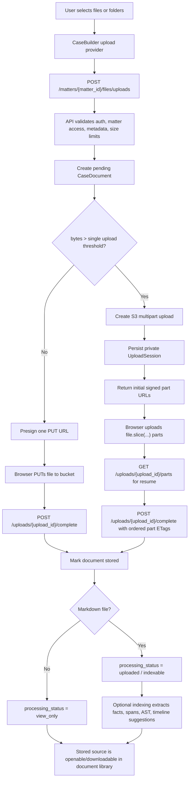
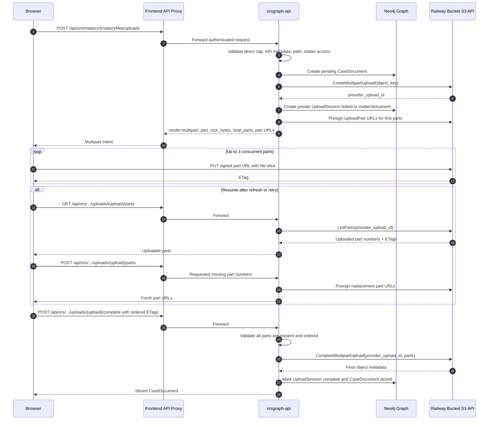
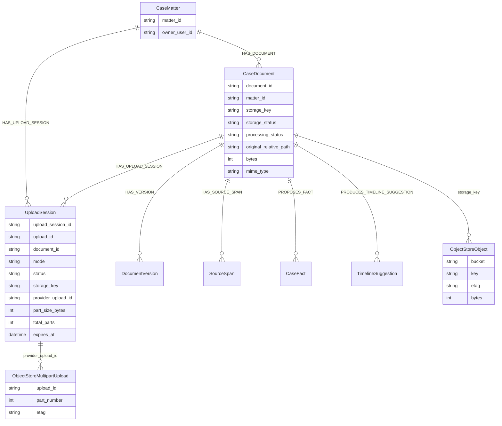
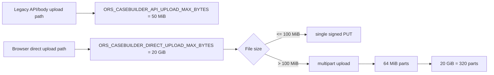

# CaseBuilder Upload Process and Storage

This diagram documents the live CaseBuilder direct-upload flow. The API creates private matter/document records and signed bucket URLs; the browser sends bytes directly to the object store.

## End-to-End Flow

## Multipart Upload Sequence

## Storage Records

## Limits and Routing

## Operational Notes

- Browser direct upload requires bucket CORS for the production frontend origin.
- Required bucket CORS methods: `GET`, `HEAD`, `PUT`.
- Required exposed response header: `ETag`.
- Multipart upload ids stay in private `UploadSession` records and are not exposed through normal document lists.
- Canceling a multipart row aborts in-flight browser requests and calls `DELETE /matters/{matter_id}/files/uploads/{upload_id}`.
- Non-Markdown files are still stored and viewable, but remain `view_only` until a dedicated parser/transcription/OCR adapter processes them.
